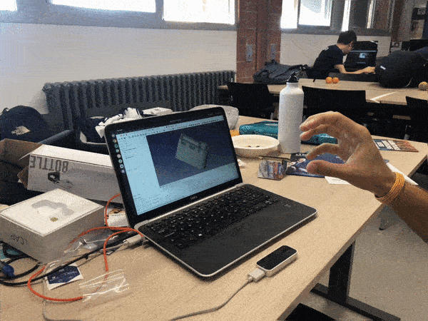
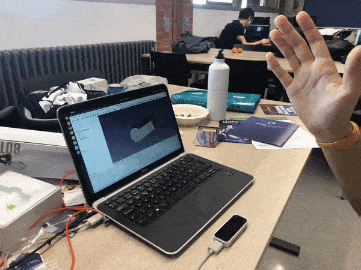

# Free LEAP

## What it does

Implements hand gestures to manipulate the 3D view in FreeCAD using the LEAP Motion controller.

## Inspiration

We want to promote the adoption of open-source software solutions in the engineering industry, and hence we are presenting to you the ultimate 3D navigation mode for FreeCAD: using your hands!

## How we built it

With patience. Lots of it. And also the FreeCAD and LEAP Motion Python APIs.

## Challenges we ran into

- Fucking broken API's. All of them.
- Qt multithreading is broken too.
- 25 different and incompatible Vector classes. :face_with_rolling_eyes:
